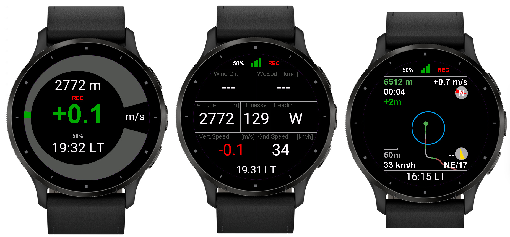

# My Vario (Garmin ConnectIQ) App

## A Variometer and tracker application for Garmin ConnectIQ devices

## Overview

This free and open-source application provides all the information you need for
free flight, tracking/logging, as well as Live Tracking via SportsTrackLive,
Livetrack24 and FlySafe, and even HUD integration with ActiveLook! A true free flight one-
stop-shop, on your watch.

## Dashboards

Multiple views/dashboards are available.

- [Global view](./USAGE.md#general-view), displaying all flight data in a single pane: altitude, ground
and vertical speeds, finesse, heading, wind direction and speed estimate, if
available (wind direction and speed are computed on the fly based on groundspeeds
when circling)

- [Variometer view](./USAGE.md#variometer-view), where the vertical speed can be visually seen

- [Varioplot/thermal assistant view](./USAGE.md#varioplot--thermal-assistant-view), allowing to keep track of your ascent/descent
rate along your flight path. This view optionally includes a detected wind-corrected
thermal core visualization to help keep within the thermal.

- [Log view](./USAGE.md#log-view), allowing to keep track of your last activities (unavailable during
flight) including flight start and end times, maximum and minimum altitudes, etc.

> An option to [auto-switch](./USAGE.md#variometer) to and from the varioplot/thermal assistant view automa-
tically (based on circling auto-detection) is available.

## Tone and vibration curves

The application makes use of the watch beeps and vibrations (if available).

- Variable-frequency tones to "sound" your ascent rate, as well as vibration-based
"tones" to fly in silence. These tones follow closely some popular variometer tone
curves (sound frequency/pitch, tone to tone or vibration to vibration pause time,
tone/vibration length - all depending on vertical speed)

- a minimum climb rate setting is available, under which sounds or vibrations won't
be triggered

- a sink rate threshold setting is available, for warning of strong sink via a long,
low frequency tone

## Live tracking

- Live tracking is possible with Livetrack24, SportsTrackLive, as well as with FlySafe to share
free flight activities in real-time, and enjoy 3D visualizations. [Read more](./USAGE.md#live-tracking)

## HUD with ActiveLook

- The App will pair to ActiveLook glasses and stream the following information in real
time throughout the flight: Altitude MSL, vertical speed, glide ratio, groundspeed, and
heading. [Read more](./USAGE.md#activelook)

## Under the hood

- The application uses a Kalman filter for fast and accurate filtering of altitude
and vertical speed (compared to the SMA filter used by GliderSK originally)

- The smoothing (and latency) applied by the Kalman filter can be changed in the settings

- The default settings are optimized for a comfortable experience out of the box

# Usage:

You **really**, **really** want to go through the Manual before first use, and test the
application at home!

[Show manual](https://github.com/ydutertre/myvario/blob/main/USAGE.md)

## Supported watches

I have reduced the number of watches supported compared to GliderSK. This is
because I am using variable frequency tones for the vario, which are only
supported for SDK 3.1.0 and above. I am testing this application on my Garmin
Fenix 7X and Forerunner 965.

## Recommended Watches

These are the watches where the My Vario app has been confirmed to be working
well:
- `Forerunner 965, 955, 255, 265`:
  The 255 and 955 however have easier to see screen in sunlight, in my opinion.
  Vibration is stronger than Fenix/Epix series.
  Tone volume seems similar to Fenix/Epix series (maybe slightly higher?)

- `Fenix 7` (*all variants, 7S, 7, 7X, Pro, etc.*)\:
  Note that Fenix watches seem to have a bug in the Garmin altitude calculation,
  although the barometric sensor works well and MyVario's altitude is accurate.
  The app doesn't rely on the Garmin altitude, so no direct impact.
  However you will see that the Garmin Altitude (from Garmin) and the Baro Altitude
  (computed by the app) recorded on the activity may not agree, especially on long
  flights.

- `Epix Gen 2` (*all variants*)
  I personally think the Fenix 7 series are better for this application, due to
  better sunlight readability

- `Fenix 6 Pro series` (*used with MyVario by a former Red Bull X-Alps athlete*). When
  testing with that athlete's watch, the baro seemed *slightly* better than Fenix 7X
  for whatever reason (purely feeling, not 100% sure and could be unit variability)

> Note: Unless explicitly stated above, GPS accuracy, Baro sensitivity, tone volume and vibration
seem to be roughly equivalent across watches. 

## Not a programmer

I am not a programmer nor developer besides some small experience
contributing to N.I.N.A., an open-source astrophotography software suite.
Monkey C, Github, Garmin SDK, etc are all new to me. I am a mere tinkerer
playing with and monkeying Cedric's work. It's likely I have introduced
errors, bugs, or code that could be extremely painful to the eyes of
experienced developers. I apologize for the pain caused!
You have been warned!

## Contributing

To contribute, you will need to go through the setup of Visual Studio Code
as well as the Garmin plug-in and related instructions, as detailed here:
https://developer.garmin.com/connect-iq/overview/

